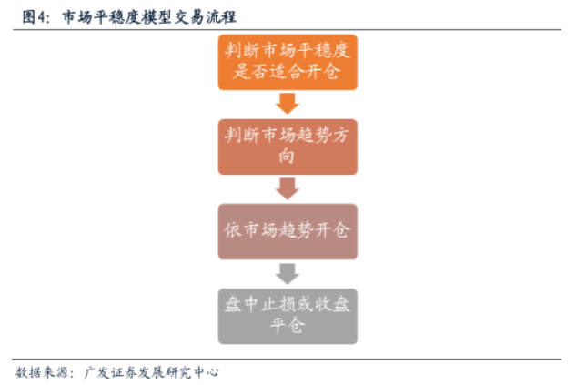

### Assignment3

#### 基于市场情绪平稳度的股指期货日内交易策略复现

本文通过观察市场早盘的走势，判断当日市场情绪受消息面的影响，从而跟随大盘趋势获利。  
策略的主要思想是在早盘的一段时间内观察大盘的走势，获得所谓的“盘感”，判断大盘后续是否会延续早盘的走势，从而决定当日是否做趋势跟踪。

#### 信号构建
  

#### 交易策略
第一步，我们需要选择一段时间作为观察窗口，对该时间内的时间序列做分析，用于预测后续行情。因此我们首先需要在样本内优化设定时间窗口长度参数t.  
第二步，通过计算市场情绪平稳度指标，判断当日是否具有开仓条件。若市场情绪平稳度指标小于阈值，则说明当日行情趋势明显，可以开仓，若情绪平稳度指标大于阈值，则说明当日行情震荡，趋势难以把握，从而放弃开仓。  
第三步，判断当天趋势的方向。若t时刻股指高于股指开盘价，则预测当日趋势为向上，在市场平稳的情况下可以做多，若t时刻股指低于股指开盘价，则预测当日趋势为向下，在市场平稳的情况下可以做空。  
第四步，平仓策略。若开盘之后损失超过止损阈值，则选择平仓止损，反之则一直持有仓位至收盘平仓。

 

复现使用的数据时间区间与原文不同，复现使用了2018-2023年沪深300股指期货数据，数据来源为通达信。

#### 实证结果显示：
在原来的参数设置下，600多个交易日内只有11次开仓，开仓次数太少，收益增长不明显  
在尝试了其他参数参数设置后，策略表现有所提升，但总体在近期的数据上表现出开仓机会过少的特点。  

